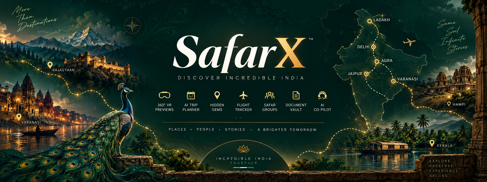

<p align="center">
  
</p>

# SafarX — Discover Incredible India

Live: **https://safarx-sih.vercel.app**

---

## 1. Project Information

- **Project Title:** SafarX — Discover Incredible India
- **PS ID:** SIH26204
- **PS Title:** Student Innovation — boosting the tourism industry, including hotels and travel
- **Organisation:** AICTE
- **Category:** Software
- **Theme:** Travel & Tourism
- **Team:** Netaji Ninjas

## 2. Problem Statement

Indian tourism runs on uncertainty. Travellers book monuments, hotels and whole trips sight-unseen, with nothing to go on but a handful of thumbnails and someone else's review. The consequence is concentration: the same dozen names absorb the visitors, the spending and the crowding, while the places a few hours away stay empty — not because they are worse, but because nobody can picture them.

Planning is fragmented in the same way. A trip is assembled across a search engine, three booking sites, a translation app and a folder of screenshots, and the parts never speak to each other. For a traveller who does not read English comfortably, most of that is closed off entirely.

## 3. Proposed Solution

SafarX removes the uncertainty before any money is spent, and keeps the whole trip in one place afterwards.

A traveller can **stand inside a heritage site in 360° before booking it**, plan the trip by talking to **Srishti** — a voice companion who operates the app while she speaks, in nine Indian languages — and carry documents, checklists, flights and the finished itinerary in the same product.

Everything is Indian: Indian sites, Indian cities, Indian budgets in ₹. There are no foreign destinations anywhere in it.

Two rules shape the build. **A VR tour is never a video** — no embeds, no vendor players, no third-party branding; every panorama is a verified, freely licensed equirectangular image rendered inside our own three.js sphere, credited on screen. And **the long tail is pushed on purpose** — the recommender carries a deliberate floor for lesser-known destinations, because sending everyone to the same twelve places is the problem, not the product.

## 4. Key Features

- **360° VR previews — 35 tours, 108 panoramas.** Draggable, in-app, multi-vantage at sites shot more than once. Never a video embed.
- **Srishti, the voice companion.** Gemini Live over a WebSocket with thirteen tools, so she acts rather than answers — opens a tour, fills the trip brief in front of you, raises the SOS beacon. Replies in the language you speak to her in.
- **AI trip planner.** A five-leg brief — destination, dates and pace, interests, budget and group, review — producing a day-by-day itinerary tuned to ₹ budget and pace. Exportable to PDF.
- **Hidden gems — 136 places across 30 states.** Offbeat sites, and now 22 regional dishes and 29 lesser-known temples, each with a credited photo carousel.
- **Local Insights map.** Leaflet exploration with multi-stop routing over OSRM — real road geometry and driving time, not straight lines.
- **Live flight tracker.** Any aircraft, in real time, on a dark radar.
- **Document vault.** Tickets, visas and IDs in private storage, with photographs shrunk client-side before upload.
- **Safety & SOS.** One-tap beacon, offline emergency directory, region-by-region safety picture Srishti can read out.
- **Safar Groups, travel diary, trip checklist.** Find travellers going where you are going; keep the trip afterwards; pack for it before.
- **Recommender dataset — 185,336 items, 18,000 users, ~10M interactions.** Built from eight real sources for the finals iteration.

## 5. Technology Stack

- **Frontend:** React 18, Vite 7, Tailwind CSS, Framer Motion, GSAP
- **3D / Maps:** three.js + React Three Fiber (the 360° viewer), Leaflet + react-leaflet, OSRM (routing)
- **State / Data:** Zustand, React Query, React Hook Form
- **Backend:** Vercel Serverless Functions (`api/`), Node
- **Database & Storage:** Supabase (Postgres + private object storage)
- **Auth:** Clerk
- **AI:** Google Gemini — itineraries and chat, and `gemini-3.1-flash-live-preview` for Srishti's voice; Hugging Face
- **Imagery:** Wikimedia Commons, Mapillary, OpenStreetMap, Google Street View (official Maps JavaScript API)
- **Data / ML tooling:** Python — pandas, NumPy, scikit-learn (`scripts/recsys/`)
- **Deployment:** Vercel

## 6. Architecture

```text
                        Traveller
                            |
                            v
        +-------------------------------------------+
        |   React 18 + Vite  (SPA, Vercel-hosted)   |
        |                                           |
        |  360° viewer   Planner   Map   Vault   …  |
        |  (three.js)              (Leaflet)        |
        +-------------------------------------------+
                            |
              +-------------+--------------+
              |                            |
              v                            v
   Vercel Serverless (api/)        Signed direct upload
              |                            |
   +----------+-----------+                v
   |          |           |          Supabase Storage
   v          v           v          (private bucket)
 Gemini    Supabase    Live data
 (text +   (Postgres)  APIs: flights,
  voice)               trains, weather
              |
              v
      Clerk (identity, verified
      on every serverless call)


   Panorama sources, resolved at view time
   ---------------------------------------
   curated Wikimedia  ->  Mapillary  ->  honest empty state
```

**How a panorama is chosen.** Curated, verified Wikimedia images are used first. Where none exists, the viewer falls back to a live Mapillary capture near the site's coordinates. Where neither exists, the tour says *"panorama coming soon"* rather than substituting a video. Whichever source is on screen is credited on screen.

**Where the files go.** Documents never pass through the API. The server issues a one-shot signed URL, the browser PUTs the bytes straight into a private bucket, and only the metadata comes back through the API — so no credential is ever in the client.

## 7. Repository Structure

```text
SafarX/
├── README.md
├── ROADMAP.md                 # per-owner workstreams, specs, acceptance criteria
├── api/                       # Vercel serverless functions
│   ├── srishti/               # voice (live.js) + text (turn.js) + tools
│   ├── documents/             # vault: signed upload URLs, delete
│   ├── flights/  trains/  stays/  groups/  music/
│   └── _server.js             # shared Clerk verification + Supabase admin
├── src/
│   ├── pages/                 # one folder or file per route
│   ├── components/
│   │   ├── vr/                # PanoramaViewer, StreetViewStage
│   │   ├── gems/              # GemThumbnail carousel
│   │   └── map/  media/  planner/
│   ├── services/              # API clients, panorama resolution
│   ├── data/                  # vrTours.json, hiddengems.json, destinations
│   ├── hooks/  contexts/  utils/
│   └── index.css              # "Peacock & Gold" design tokens
├── scripts/
│   ├── recsys/                # catalogue, generator, validator, baselines
│   └── verify-panoramas.py    # checks every tour still resolves
├── data/recsys/               # the generated dataset + its README
├── docs/                      # banner, architecture notes
├── public/media/              # background videos, posters
└── package.json
```

### What goes where?

| Item | Location |
|---|---|
| Frontend source | `src/` |
| Serverless API | `api/` |
| Architecture / technical documentation | `docs/`, `ROADMAP.md` |
| Dataset build + validation scripts | `scripts/recsys/` |
| Generated recommender dataset | `data/recsys/` |
| Tour and gem content | `src/data/` |
| Project overview | `README.md` |

## 8. Final Presentation

**[SafarX — SIH 2026 presentation](https://drive.google.com/file/d/1hqqQfOrrW0rnUZ_0mzg0YzknNsPYcHW4/view?usp=sharing)** (Google Drive)

The deck is hosted on Drive rather than committed, since the file is larger than is comfortable in a git repository.

## 9. Demo Video

**[Watch the demo on YouTube](https://youtu.be/D3WiZ2NqoYU)**

A walkthrough of the whole platform — the 360° tours, the AI trip planner, hidden gems, the Local Insights map, the document vault and Srishti.

## 10. Screenshots / Prototype Photos

The product is deployed and can be used directly at **https://safarx-sih.vercel.app** — the live site is the prototype, so screenshots are a convenience rather than the evidence.

## 11. Installation

```bash
git clone https://github.com/garvbahl37-gif/SafarX.git
cd SafarX
npm install
```

The app runs with **no keys at all**. Auth, uploads, live panoramas and Srishti each degrade to an honest empty state rather than breaking, so a reviewer can clone and run it immediately.

For the full experience, create `.env` in the project root:

```env
# Srishti and the AI planner
GEMINI_API_KEY=your_gemini_key

# 360° panoramas — free, no card, from mapillary.com/dashboard/developers
VITE_MAPILLARY_TOKEN=your_mapillary_token

# Street View tours — Maps JavaScript API, billing enabled on the project
VITE_GOOGLE_MAPS_KEY=your_maps_key

# Identity and data
VITE_CLERK_PUBLISHABLE_KEY=your_clerk_publishable_key
CLERK_SECRET_KEY=your_clerk_secret_key
VITE_SUPABASE_URL=your_supabase_url
VITE_SUPABASE_ANON_KEY=your_supabase_anon_key
SUPABASE_URL=your_supabase_url
SUPABASE_SERVICE_ROLE_KEY=your_supabase_service_role_key

# Live data
VITE_OPENWEATHER_API_KEY=your_openweather_key
AVIATIONSTACK_API_KEY=your_aviationstack_key
RAILRADAR_API_KEY=your_railradar_key
RAPIDAPI_KEY=your_rapidapi_key
```

> Only `VITE_`-prefixed values are compiled into the browser bundle and are therefore public by design. Every secret above — `GEMINI_API_KEY`, `CLERK_SECRET_KEY`, `SUPABASE_SERVICE_ROLE_KEY` and the live-data keys — must **never** be given a `VITE_` prefix.

## 12. Run

```bash
npm run dev        # development server
npm run build      # production build
npm run preview    # serve the production build locally
npm run lint       # eslint
```

Dataset tooling, run from the repository root:

```bash
python3 scripts/recsys/catalogue.py    # build the 185k-item catalogue
python3 scripts/recsys/generate.py     # generate interactions
python3 scripts/recsys/validate.py     # 16 structural checks over the dataset
python3 scripts/recsys/baseline.py     # popularity vs collaborative filtering
```

## 13. Future Scope

Each workstream is owned end-to-end and maps back to the problem statement. Full specs are in [ROADMAP.md](ROADMAP.md).

| Owner | Workstream | Highlights |
|---|---|---|
| **Lucky** | Booking & revenue engine | Hotel discovery beside VR previews, a self-serve hotel partner program letting small hotels upload their own 360° room tours, dynamic occupancy deals, train/bus/cab integration, plus allied industries — regional cuisine, GI-tagged crafts, a festival calendar |
| **Dhruv** | Safar Groups 2.0 | Supabase-backed membership, collaborative itineraries, live chat, expense splitting with settlements, polls, meetups, photo walls, verification and safety |
| **Aryan** | SafarX Agent | Gemini function calling (search, plan and book from chat), RAG over an India heritage knowledge base, trip memory, a season-aware activities engine |
| **Garv** | Recommender system · Kahani | Implicit-ALS collaborative filtering, sentence-transformer content embeddings over FAISS, seasonality priors, and a deliberate long-tail floor that pushes lesser-known destinations — plus **Kahani**, narrated heritage stories in 22 Indian languages, geo-triggered at monuments and inside VR tours |
| **Rahul** | Confidence & safety | Crowd prediction with quiet-window nudges, SOS and offline emergency directory, regional-language UI, Local Language Survival Mode (speak it, show it, hear the reply translated, offline-capable), offline PWA mode, sustainability scores |

**Policy:** free-tier APIs only, no paid contracts.

## Important

No passwords, API keys, access tokens or `.env` files are committed to this repository. `.env` is git-ignored, and every secret is supplied through the deployment environment. Reviewers can clone and run the project without any credentials at all.

---

Built by **Netaji Ninjas** for Smart India Hackathon 2026.
